

<h1>Privacy Auditor</h1>
<h2>Relatório final de avaliação de privacidade</h2>

<strong>Avaliação Intermediária de Cibersegurança</strong>

Extensão para Firefox para detecção e bloqueio de rastreadores

<strong>Data da coleta:</strong> 28/09/2026

<strong>Firefox:</strong> 156.0.1

<strong>Plataforma:</strong> Firefox — Manifest V2

## Sumário

1. Objetivo dos testes
2. Metodologia e evidências disponíveis
3. Justificativa da escolha dos sites
4. Análise do UOL
5. Análise do Mercado Livre
6. Análise da Wikipedia
7. Comparação entre Privacy Auditor, Blacklight, uBlock e HAR
8. Comparação e metodologia dos scores de privacidade
9. Informações sensíveis nos HARs
10. Limitações
11. Conclusão
12. Reconciliação detalhada das ferramentas
13. Testes DuckDuckGo Privacy Test Pages
14. Validação técnica
15. Índice das evidências

## 1. Objetivo dos testes

Comparar as observações do Privacy Auditor com o relatório do Blacklight, o
Logger do uBlock Origin e o tráfego exportado em HAR nos sites UOL, Mercado
Livre e Wikipedia.

Os resultados são descritivos e heurísticos. Eles não demonstram intenção de
rastreamento ou ataque por si sós.

## 2. Metodologia e evidências disponíveis

O procedimento planejado está em
[`evidencias/sites/METODOLOGIA.md`](evidencias/sites/METODOLOGIA.md). Para cada
site foram disponibilizados prints do Privacy Auditor, do Blacklight e do
uBlock Origin, além de um HAR. O analisador local produziu resumos Markdown e
JSON sem alterar os HARs originais.

Houve desvios que impedem uma comparação controlada estrita:

- os HARs cobrem janelas diferentes: cerca de 176,7 s no UOL, 3,8 s no Mercado
  Livre e 15,9 s na Wikipedia, em vez dos 30 s padronizados;
- os horários dos prints do Privacy Auditor não coincidem integralmente com os
  intervalos dos HARs;
- os prints do Blacklight não incluem todas as seções nem listas expandidas;
- proteção contra rastreamento, estado de login e interações não foram
  comprovados nos arquivos; as decisões dos banners foram informadas durante a
  coleta manual.

Assim, as contagens são comparadas como execuções distintas e não como medições
sincronizadas do mesmo tráfego.

## 3. Justificativa da escolha dos sites

- UOL representa um portal de notícias financiado por publicidade.
- Mercado Livre representa uma plataforma de comércio eletrônico.
- Wikipedia serve como referência comparativa, com modelo e finalidade diferentes.

A seleção cobre contextos com modelos econômicos e finalidades diferentes sem
pressupor antecipadamente qual deles teria melhor privacidade.

## 4. Análise do UOL

O Privacy Auditor registrou 472 requisições, 37 domínios registráveis de
terceiro, 11 cookies persistentes de terceiros e score 39/100. Detectou possível
compartilhamento de identificador e polling persistente, mas não canvas nem
bounce tracking. O Blacklight apresentou 21 ad trackers e 14 cookies de
terceiros, não encontrou session recording, key logging nem mecanismo que
contornasse bloqueadores e indicou interação com Facebook. O uBlock Origin
registrou 47 bloqueios (11%) e 17 de 25 domínios conectados; o Logger mostra
bloqueios XHR para `doubleclick.net` e `youtube.com`.

O HAR contém 494 requisições, 67 hosts e 33 possíveis domínios registráveis de
terceiro. Nele aparecem serviços publicitários e de medição como
`googlesyndication.com`, `doubleclick.net`, `adnxs.com`,
`scorecardresearch.com`, `amazon-adsystem.com`, `criteo.com` e
`rubiconproject.com`. Há 138 cabeçalhos `Set-Cookie` em 65 respostas e 93
combinações heurísticas de parâmetro/domínio/regra. Dois padrões temporais
concretos sustentam a indicação de polling: 33 GETs para um manifesto de vídeo
em `video47.mais.uol.com.br`, com intervalo médio de cerca de 5 s, e 17 POSTs
para `events.newsroom.bi`, com média de cerca de 15 s.

As diferenças de 472 versus 494 requisições e 37 versus 33 terceiros são
compatíveis com as janelas diferentes. Os 11 cookies de terceiros do plugin, 14 do
Blacklight e 138 cabeçalhos do HAR não são métricas equivalentes: as duas
ferramentas podem contar estado final/cookies únicos, enquanto o HAR conta cada
tentativa de definição, inclusive repetições.

Análise e tabela domínio/indicador:
[`evidencias/sites/uol/analise.md`](evidencias/sites/uol/analise.md).

### Evidências — UOL

**Privacy Auditor — visão geral e score**

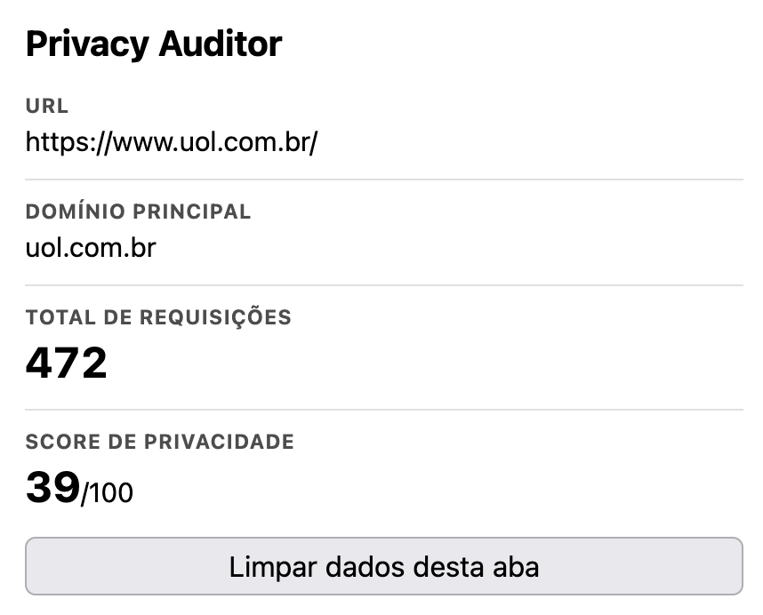

**Blacklight — trackers e cookies**

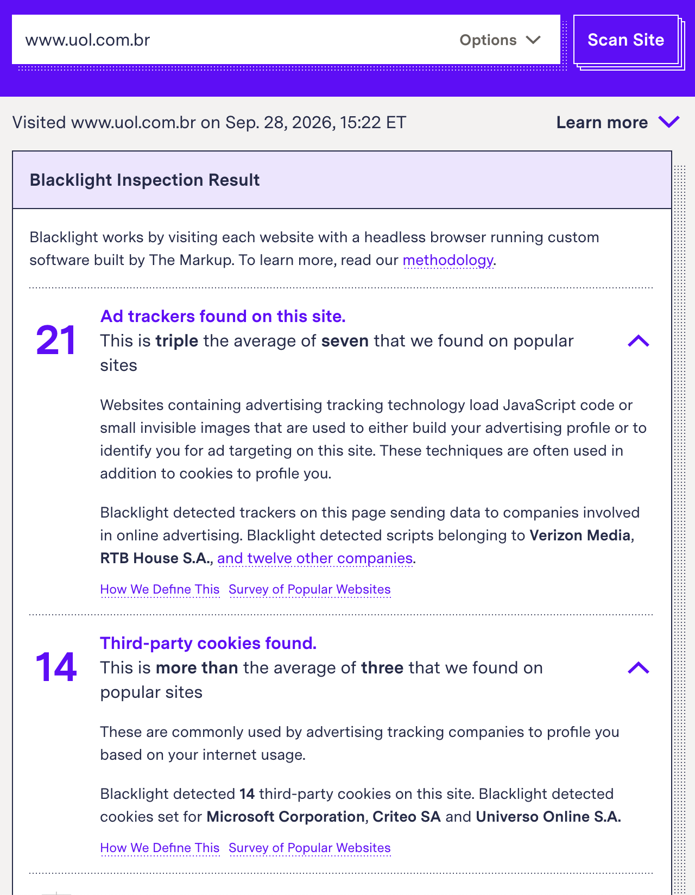

**uBlock Origin — resumo dos bloqueios**

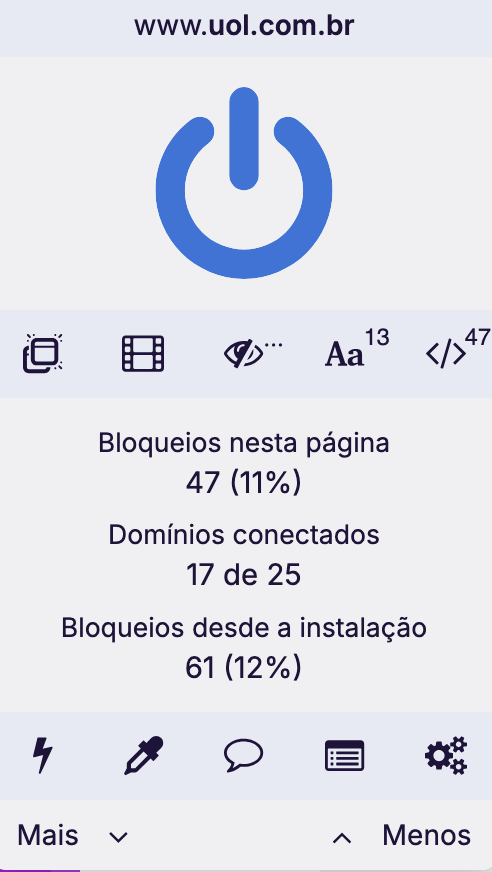

## 5. Análise do Mercado Livre

O Privacy Auditor registrou 236 requisições, 9 domínios registráveis de
terceiro, 8 cookies persistentes de terceiros e score 45/100. Não detectou
canvas ou bounce, mas detectou possível compartilhamento de identificador e
substituição de `fetch` e `XMLHttpRequest.open`. O
Blacklight apresentou 11 ad trackers e 16 cookies de terceiros, não encontrou
session recording, key logging nem mecanismo para contornar bloqueadores e
indicou interação com Facebook. O uBlock Origin registrou 53 bloqueios (8%) e
9 de 14 domínios conectados; o Logger mostra bloqueio XHR para
`mercadoclics.com` e aplicação do scriptlet `prevent-clipboard-write`.

O HAR, limitado a 3,8 s, contém 122 requisições, 11 hosts e 7 possíveis
domínios registráveis de terceiro: `google.com`, `gstatic.com`, `hotjar.com`,
`meli.com`, `mercadoclics.com`, `mercadolibre.com` e `mlstatic.com`. Há 15
cabeçalhos `Set-Cookie` em 13 respostas, inclusive em `meli.com` e
`mercadoclics.com`, e 8 candidatos heurísticos a parâmetro identificador.
Nenhum redirect, WebSocket ou polling foi detectado.

A lista do popup e o HAR coincidem em seis domínios registráveis, incluindo
`meli.com`, `mercadoclics.com`, `mercadolibre.com` e `mlstatic.com`. A diferença
de 9 contra 7 decorre de execuções e janelas distintas. A
presença de scripts do Hotjar no HAR não prova session recording; o Blacklight
não observou esse comportamento. O HAR também não consegue verificar a
substituição de funções JavaScript detectada pelo plugin.

Análise e tabela domínio/indicador:
[`evidencias/sites/mercado-livre/analise.md`](evidencias/sites/mercado-livre/analise.md).

### Evidências — Mercado Livre

**Privacy Auditor — visão geral e score**

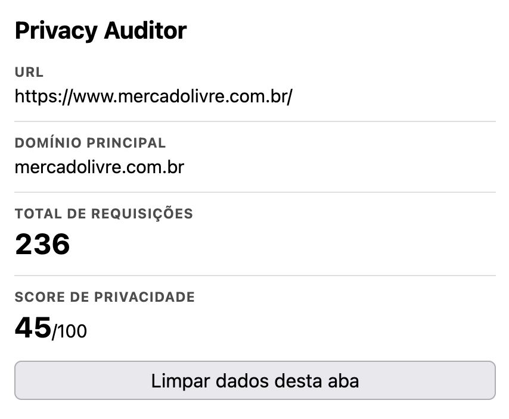

**Blacklight — trackers e cookies**

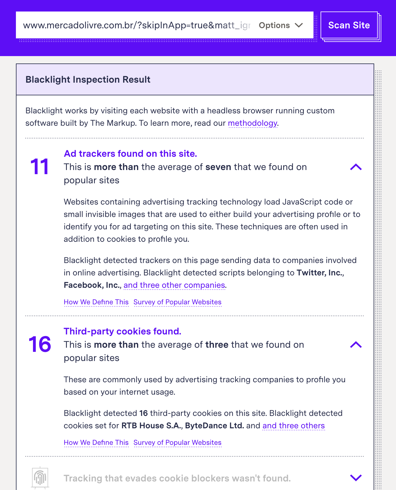

**uBlock Origin — resumo dos bloqueios**

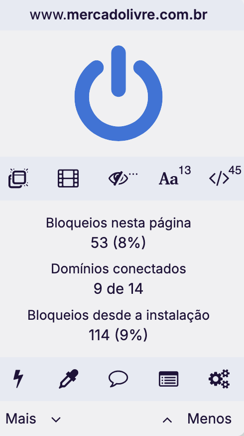

## 6. Análise da Wikipedia

O Privacy Auditor registrou 40 requisições, 1 domínio registrável de terceiro,
13 cookies persistentes e score 78/100. Não detectou canvas, bounce, cookie sync,
polling ou substituição de API. O Blacklight apresentou 0 ad trackers e 4
cookies de terceiros, não encontrou session recording, key logging, Facebook
Pixel, TikTok Pixel ou mecanismo para contornar bloqueadores. O uBlock Origin
registrou 0 bloqueios e 2 de 2 domínios conectados, em concordância com a
ausência de ad trackers no Blacklight.

O HAR contém 38 requisições e apenas três hosts: `pt.wikipedia.org` (19),
`upload.wikimedia.org` (17) e `meta.wikimedia.org` (2). Os dois últimos se
agrupam no único domínio registrável de terceiro, `wikimedia.org`, em
concordância com a contagem do plugin. Quatro cabeçalhos `Set-Cookie`, com dois
nomes únicos, aparecem em `upload.wikimedia.org`. Não há redirects, WebSockets
ou polling. Os candidatos heurísticos `modules`, `image` e `title` têm contexto
de conteúdo/configuração e não sustentam cookie sync.

A diferença entre 40 e 38 requisições pode decorrer das janelas distintas. A
diferença entre 10 cookies de terceiro no plugin, 4 cookies no
Blacklight e 4 cabeçalhos no HAR pode resultar de contagem de estado final,
nomes únicos ou eventos repetidos. O HAR sustenta a presença de definição de
cookies em um domínio de terceiro, mas não equipara as taxonomias.

Análise e tabela domínio/indicador:
[`evidencias/sites/wikipedia/analise.md`](evidencias/sites/wikipedia/analise.md).

### Evidências — Wikipedia

**Privacy Auditor — visão geral e score**

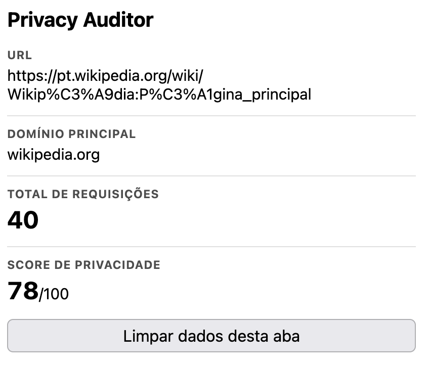

**Blacklight — trackers e cookies**

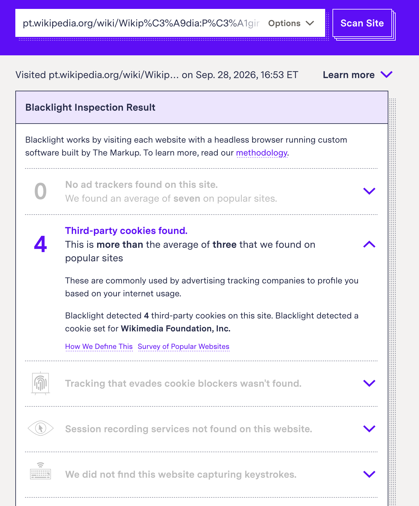

**uBlock Origin — resumo dos bloqueios**

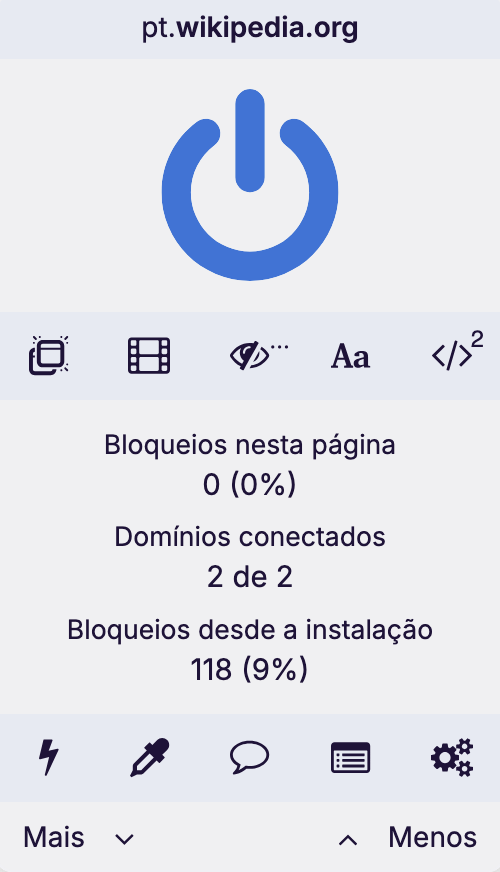

## 7. Comparação entre Privacy Auditor, Blacklight, uBlock e HAR

| Aspecto | UOL | Mercado Livre | Wikipedia |
| --- | --- | --- | --- |
| Requisições — Privacy Auditor / HAR | 472 / 494 | 236 / 122 | 40 / 38 |
| Terceiros — Privacy Auditor / HAR | 37 / 33 domínios registráveis possíveis | 9 / 7 domínios registráveis possíveis | 1 / 1 domínio registrável |
| Cookies de terceiros — Privacy Auditor / Blacklight | 11 persistentes / 14 | 8 persistentes / 16 | 9 persistentes + 1 de sessão / 4 |
| Ad trackers — Blacklight | 21 | 11 | 0 |
| Canvas — Privacy Auditor / Blacklight | não / PENDENTE | não / PENDENTE | não / PENDENTE |
| Session recording — Blacklight | não encontrado | não encontrado | não encontrado |
| Key logging — Blacklight | não encontrado | não encontrado | não encontrado |
| uBlock Origin | 47 bloqueios (11%); 17/25 domínios conectados | 53 bloqueios (8%); 9/14 domínios conectados | 0 bloqueios; 2/2 domínios conectados |

O Privacy Auditor observa a aba real no Firefox e agrupa terceiros por domínio
registrável. O Blacklight executa uma visita remota e classifica comportamentos
específicos, como ad trackers; “21 ad trackers” não significa necessariamente
21 domínios. O HAR registra tráfego e cabeçalhos, mas não comprova que um cookie
foi aceito nem observa chamadas JavaScript como leitura de canvas ou hooks.
Os Logs do uBlock comprovam exemplos de bloqueio, mas as capturas não exportam
a lista completa das 47 e 53 ocorrências; a comparação domínio a domínio fica
limitada ao conteúdo visível.

Os prints recolhem as listas completas do Privacy Auditor e do Blacklight.
Logo, a lista de hosts do HAR foi usada somente como evidência do tráfego e não
foi atribuída retroativamente a essas ferramentas.

## 8. Comparação dos scores de privacidade

O score começa em 100 e cada categoria aplica descontos limitados ao respectivo
peso máximo. A lista personalizada de bloqueio não altera o score: a pontuação
representa os sinais observados na página, e não as preferências do usuário.

| Categoria | Peso máximo | Critério de desconto | Justificativa |
| --- | ---: | --- | --- |
| Domínios de terceiros | 20 | 2 pontos por domínio registrável distinto | Mais terceiros ampliam a superfície de exposição, embora um terceiro não seja necessariamente um tracker. |
| Cookies | 20 | 3 por persistente de terceiro; 2 por sessão de terceiro; 1 por persistente de primeira parte | Cookies de terceiro e persistentes recebem maior peso pelo potencial de correlação entre visitas e contextos. |
| Armazenamento HTML5 | 10 | Por origem: 2 por localStorage; 1 por sessionStorage; 3 por IndexedDB com dados | Storage pode manter estado no cliente, mas seu uso isolado também possui finalidades legítimas. |
| Canvas fingerprinting | 20 | 20 quando ocorre tentativa de leitura do canvas | A leitura pode contribuir para uma identificação relativamente estável sem depender de cookie. |
| Bounce tracking e cookie sync | 15 | 7 por possível bounce; 8 por possível compartilhamento de identificador | Esses sinais indicam possível correlação entre domínios, mas permanecem heurísticos. |
| Hijacking e hooks | 15 | 8 por substituição de API; 4 por WebSocket de terceiro; 3 por polling | Alterações de APIs e comunicação persistente merecem destaque, mas também podem ocorrer em aplicações legítimas. |

Cada categoria é limitada ao peso indicado e o resultado mínimo é zero. Canvas,
bounce, cookie sync e hooks são tratados como indícios, não como comprovação de
ataque. Polling exige ao menos quatro chamadas recentes ao mesmo endpoint, com
intervalos entre 250 ms e 60 s e desvio máximo de 35% em relação à média. Bounce
tracking usa uma janela de três segundos entre navegações automáticas.

| Site | Score do Privacy Auditor | Principais descontos visíveis | Leitura comparativa |
| --- | ---: | --- | --- |
| UOL | 39/100 | terceiros −20; cookies −20; storage −10; sync −8; polling −3 | Menor score e maior diversidade de terceiros/cookies nas evidências. |
| Mercado Livre | 45/100 | terceiros −18; cookies −20; storage −1; sync −8; substituição de API −8 | Intermediário; o HAR curto limita a reconciliação das 236 requisições. |
| Wikipedia | 78/100 | terceiros −2; cookies −20 | Maior score, com tráfego concentrado em Wikipedia/Wikimedia, nenhum bloqueio no uBlock e nenhum ad tracker no Blacklight. |

Os scores são internos ao Privacy Auditor e seguem pesos documentados no
README. Blacklight e uBlock não fornecem, nas evidências disponíveis, um score
diretamente comparável. A ordem observada é Wikipedia (78), Mercado Livre (45)
e UOL (39), mas as execuções não tiveram duração e controles uniformes.

## 9. Informações sensíveis nos HARs

Os originais não foram alterados. Eles contêm dados que precisam ser revisados
antes de publicação:

| Site | Cookie em requisições | Set-Cookie | Query | POST | Referer | Conteúdos de resposta | IPs de servidor |
| --- | ---: | ---: | ---: | ---: | ---: | ---: | ---: |
| UOL | 246 cabeçalhos; 4514 objetos | 138 cabeçalhos | 1974 parâmetros | 95 corpos | 487 | 353 | 330 |
| Mercado Livre | 12 cabeçalhos; 48 objetos | 15 cabeçalhos | 52 parâmetros | 12 corpos | 95 | 82 | 33 |
| Wikipedia | 15 cabeçalhos; 80 objetos | 4 cabeçalhos | 117 parâmetros | 0 | 35 | 12 | 9 |

Nenhum cabeçalho `Authorization` foi encontrado. Mesmo assim, cookies,
identificadores em URLs/corpos, referenciadores e conteúdo de respostas podem
revelar sessão, localização ou histórico. Os resumos mascaram valores, mas os
HARs originais devem ser redigidos ou mantidos fora de divulgação pública após
revisão manual e autorização.

## 10. Limitações

- As capturas do uBlock mostram totais e exemplos, mas não uma exportação
  completa de todos os domínios e tipos bloqueados.
- As durações dos HARs são diferentes e duas são menores que 30 segundos.
- Os prints do Privacy Auditor e os HARs não são perfeitamente simultâneos.
- As listas de domínios do popup e do Blacklight não estão expandidas.
- As seções de canvas e parte dos pixels do Blacklight não aparecem nos prints.
- Proteção do Firefox, login, consentimento e interações permanecem pendentes.
- Cache, conteúdo dinâmico, geolocalização, leilões publicitários e horário
  alteram o tráfego entre execuções.
- As novas capturas mostram os domínios principais corrigidos como `uol.com.br`
  e `mercadolivre.com.br`.
- Parâmetros, polling, cookie sync, hooks e bounce são heurísticas e admitem
  falsos positivos e falsos negativos.

## 11. Conclusão

As evidências distinguem claramente os três cenários: o UOL teve a maior
quantidade e diversidade de terceiros, o maior percentual de bloqueio e o menor
score; o Mercado Livre teve o maior número absoluto de bloqueios e ficou em
posição intermediária no score; e a Wikipedia concentrou o tráfego nos
ecossistemas Wikipedia/Wikimedia, não apresentou bloqueios no uBlock nem ad
trackers no Blacklight e obteve o maior score. O HAR confirmou padrões de
polling no UOL, terceiros no Mercado Livre e o único domínio registrável de
terceiro da Wikipedia.

A reconciliação integral domínio a domínio exigiria exportações completas dos
Loggers, HARs com janela uniforme e relatórios expandidos do Blacklight. As
evidências atuais já permitem a comparação quantitativa dos bloqueios e a
reconciliação dos exemplos visíveis.

## 12. Reconciliação detalhada das ferramentas

### 12.1 UOL

| Domínio ou indicador | Privacy Auditor | Blacklight | uBlock Origin | Evidência no HAR | Explicação técnica |
| --- | --- | --- | --- | --- | --- |
| Terceiros | 37 domínios registráveis | 21 ad trackers | 17 de 25 domínios conectados | 33 possíveis domínios registráveis de terceiro | As métricas não são equivalentes: o plugin e o HAR observaram execuções distintas, o Blacklight conta trackers classificados e o uBlock altera o tráfego antes do carregamento. |
| Cookies de terceiros | 11 persistentes | 14 | Não é uma métrica do Logger | 138 `Set-Cookie` em 65 respostas | O plugin observa o cookie jar, o Blacklight usa navegador remoto e o HAR conta eventos de resposta, inclusive repetições. |
| `doubleclick.net` | Presente na lista de terceiros | Lista nominal não expandida | Bloqueio XHR visível | `securepubads.g.doubleclick.net` presente | Há concordância nominal entre plugin, uBlock e HAR. |
| Polling | Detectado | Não informado | Repetições XHR visíveis | Padrões em `video47.mais.uol.com.br` e `events.newsroom.bi` | A repetição temporal sustenta a heurística, mas não comprova finalidade maliciosa. |
| Cookie sync/query | Possível detecção | Não informado | Não é métrica do Logger | 93 candidatos em 22 hosts | O HAR sustenta a presença de parâmetros candidatos, mas seus valores mascarados não permitem reproduzir a correlação por hash do plugin. |

### 12.2 Mercado Livre

| Domínio ou indicador | Privacy Auditor | Blacklight | uBlock Origin | Evidência no HAR | Explicação técnica |
| --- | --- | --- | --- | --- | --- |
| Terceiros | 9 domínios registráveis | 11 ad trackers | 9 de 14 domínios conectados | 7 possíveis domínios registráveis de terceiro | Seis domínios coincidem entre plugin e HAR; diferenças decorrem das janelas e taxonomias. |
| Cookies de terceiros | 8 persistentes | 16 | Não é uma métrica do Logger | `Set-Cookie` em `meli.com` e `mercadoclics.com` | Estado final, visita remota e eventos HTTP são medidas diferentes. |
| `mercadoclics.com` | Terceiro e cookie `_d2id` observado | Lista nominal não expandida | XHR bloqueada | 13 requisições e `Set-Cookie` | Há concordância nominal entre plugin, uBlock e HAR. |
| Hooks | `fetch` e `XMLHttpRequest.open` substituídos | Não é métrica apresentada | Scriptlet `prevent-clipboard-write` aplicado | HAR não observa identidade de funções | Hooks e scriptlets são eventos de execução JavaScript que não aparecem em um HAR. |
| Cookie sync/query | Possível mesmo hash no parâmetro `value` | Não informado | Não é métrica do Logger | Oito candidatos, sem correlação de hash | O resumo seguro do HAR descarta valores e não pode confirmar a igualdade observada localmente. |

### 12.3 Wikipedia

| Domínio ou indicador | Privacy Auditor | Blacklight | uBlock Origin | Evidência no HAR | Explicação técnica |
| --- | --- | --- | --- | --- | --- |
| Terceiros | 1: `wikimedia.org` | 0 ad trackers | 2 de 2 domínios conectados; 0 bloqueios | 1 domínio registrável de terceiro | “Terceiro” descreve relação de origem e não implica que o domínio seja tracker. |
| Cookies de terceiros | 9 persistentes e 1 de sessão | 4 | Nenhum bloqueio | 4 `Set-Cookie` em `upload.wikimedia.org` | As diferenças decorrem de execuções e unidades de contagem distintas. |
| Subdomínios Wikimedia | `auth` e `meta` agrupados sob `wikimedia.org` | Cookie atribuído à Wikimedia Foundation | Recursos permitidos | `upload` e `meta` presentes | Subdomínios diferentes pertencem ao mesmo domínio registrável. |
| Pixels publicitários | Não observados | Facebook e TikTok não detectados | 0 bloqueios | Hosts correspondentes ausentes | As quatro fontes são compatíveis dentro das janelas observadas. |

## 13. Testes DuckDuckGo Privacy Test Pages

| Teste | Esperado pela página | Resultado do Privacy Auditor | Avaliação |
| --- | --- | --- | --- |
| Tracker Reporting | Carregar um tracker conhecido por `script src` | 3 requisições; `doubleclick.net` como terceiro; score 98 | Concordância no nível de rede. A extensão não atribui reputação de “major tracker”. |
| Storage Blocking | Exercitar armazenamento em contexto de terceiro | 3 origens com localStorage, 3 com sessionStorage, 2 com IndexedDB e 24 eventos de cookie | O plugin inventaria armazenamento; não afirma que ele foi bloqueado. |
| Fingerprinting | Coletar atributos utilizáveis em fingerprint | 10 leituras de canvas por `getImageData` e `toDataURL` | Concordância parcial: o monitor cobre canvas, não todos os atributos do navegador. |
| Canvas Verification | Realizar renderização e leitura de canvas | 127 leituras, com referência a `fingerprinting/canvas.js` | Concordância. Nenhum pixel ou conteúdo foi armazenado. |
| Tracker Blocking | Bloquear recursos de `bad.third-party.site` | Bloqueio ativo e 22 correspondências detectadas | O JSON registra 10 `not loaded`, 12 `failed` e 1 `loaded`; a contagem visual de “Bloqueadas” permanece PENDENTE. |
| Storage Partitioning | Verificar isolamento de storage por primeira parte | 26 requisições, 1 terceiro, 10 cookies e storage em uma origem | O popup inventaria por origem/frame, mas não mede equivalência entre partições. |
| Query Parameters | Remover parâmetros de rastreamento e preservar os funcionais | Resultado do popup PENDENTE | A extensão detecta candidatos, mas não implementa remoção de parâmetros. |
| Bounce Tracking | Passar rapidamente por domínio intermediário | Execução anterior à correção: não detectado; repetição PENDENTE | A implementação foi corrigida, mas não se presume sucesso sem nova evidência manual. |
| JavaScript leaks/hijacking | Exercitar WebSocket, polling, scripts e alterações de APIs | PENDENTE | Não há capturas DDG suficientes deste conjunto. |

### 13.1 Evidências dos testes DDG

#### Tracker Reporting

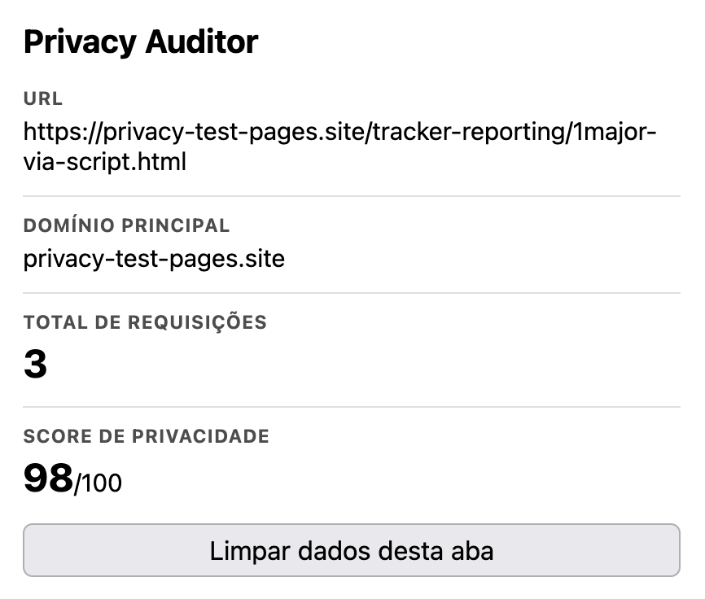

#### Storage Blocking

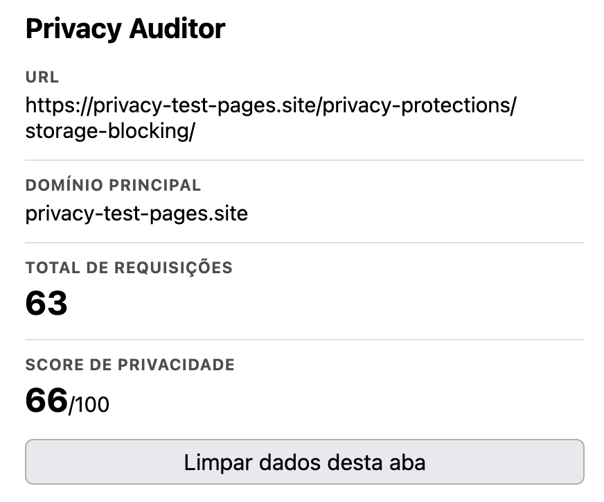

#### Fingerprinting

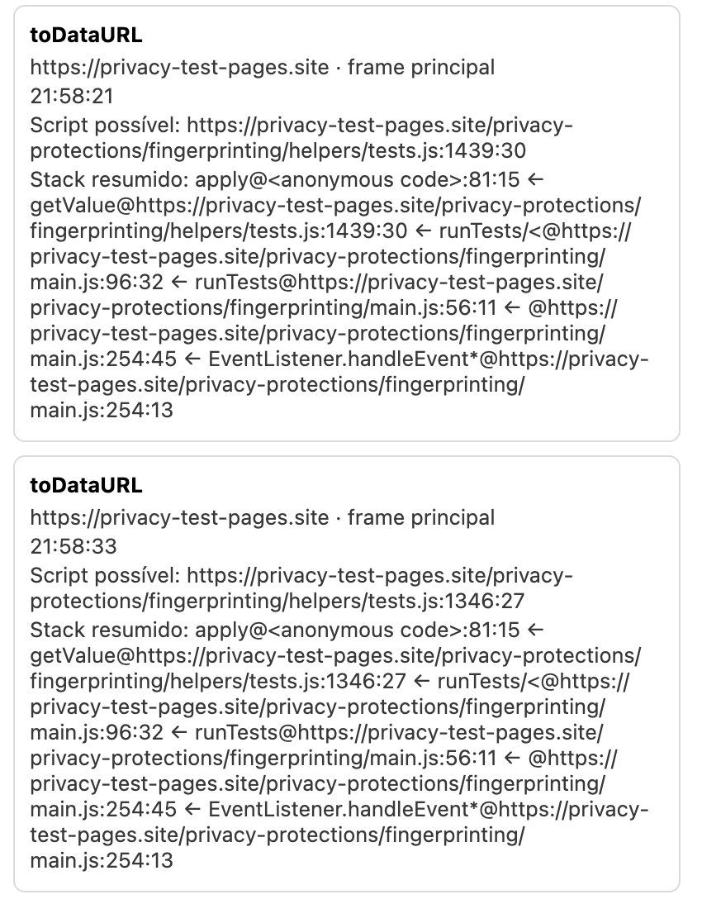

#### Canvas Verification

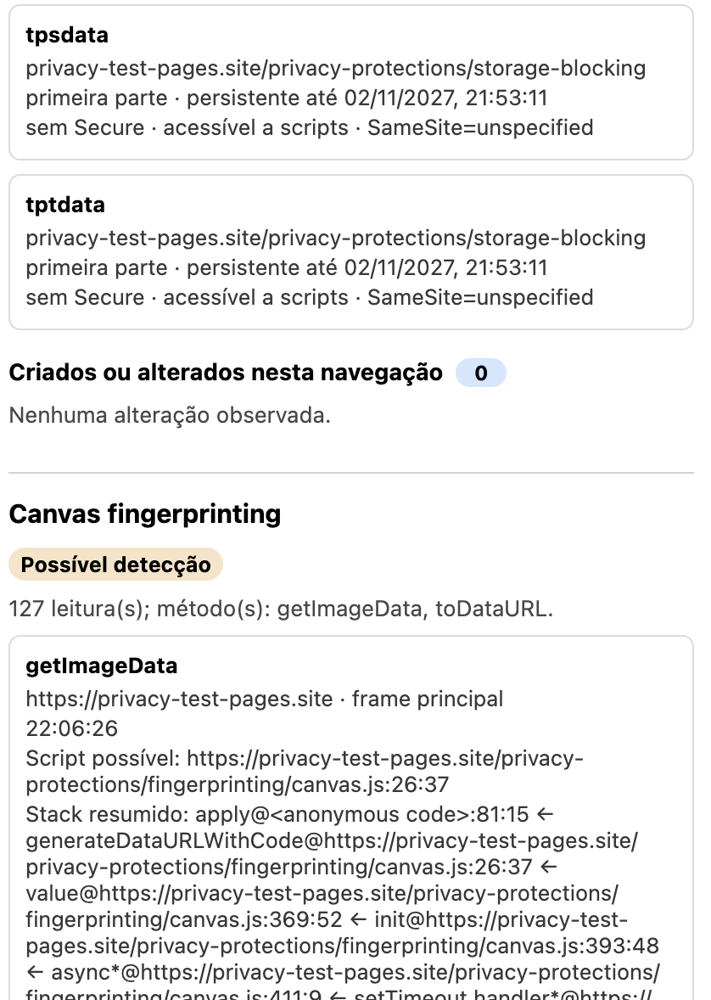

#### Tracker Blocking

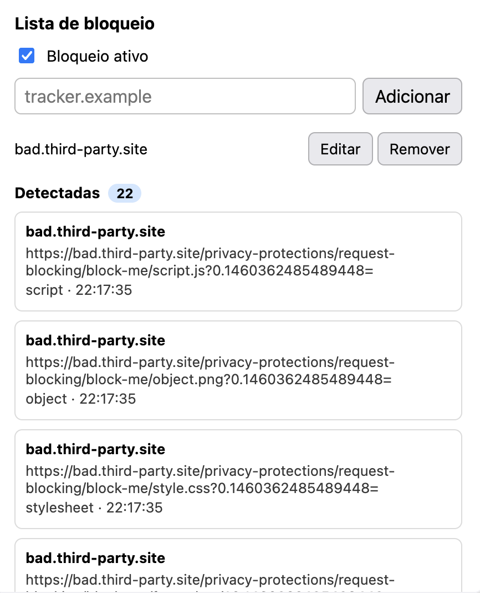

#### Storage Partitioning

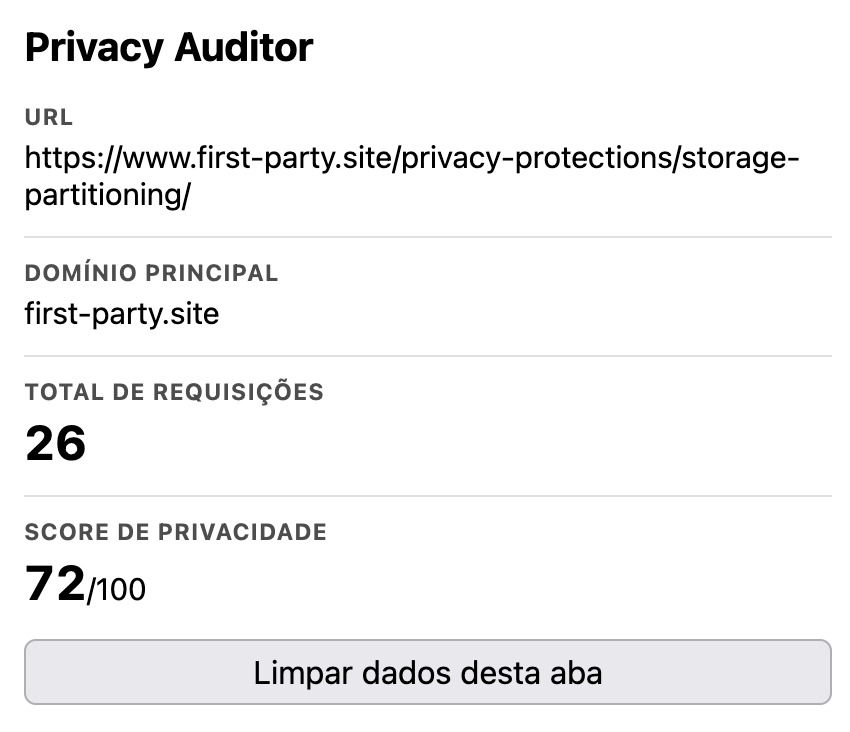

#### Query Parameters

A coleta disponível registra o resultado da página, mas não o popup. A imagem é
mantida como evidência parcial e não é apresentada como resultado do plugin.

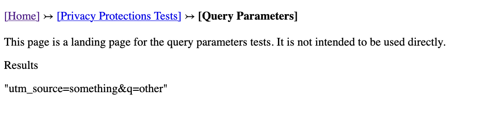

#### Bounce Tracking

A captura abaixo documenta a execução anterior à correção, na qual o plugin não
detectou a cadeia. A repetição pós-correção continua necessária.

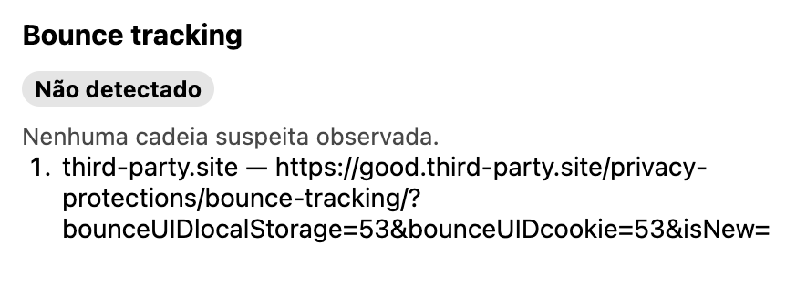

#### JavaScript leaks/hijacking

**PENDENTE:** não existe captura deste conjunto de páginas. Nenhuma evidência foi
fabricada ou substituída por resultado de outro teste.

A análise completa, com links para cada captura, permanece em
[`evidencias/ddg/analise.md`](evidencias/ddg/analise.md).

## 14. Validação técnica

- Testes automatizados: 25 aprovados, 0 falhas.
- `web-ext lint`: 0 erros, 0 avisos e 0 notificações.
- O analisador de HAR possui testes com arquivo fictício e não modifica os HARs
  originais.
- Não foram enviados dados a serviços externos pelo analisador ou pela extensão.
- Valores originais usados nas heurísticas de identificador são comparados por
  hash local e não são apresentados no popup.

## 15. Índice das evidências

- UOL: `evidencias/sites/uol/`.
- Mercado Livre: `evidencias/sites/mercado-livre/`.
- Wikipedia: `evidencias/sites/wikipedia/`.
- DuckDuckGo Privacy Test Pages: `evidencias/ddg/prints/`.
- Metodologia padronizada: `evidencias/sites/METODOLOGIA.md`.
- Resumos seguros dos HARs: arquivos `*.summary.md` e `*.summary.json` nas
  respectivas pastas `har/`.

Os arquivos `analise.md` individuais são registros auxiliares de rastreabilidade.
Este documento reúne os resultados necessários para leitura e avaliação em um
único relatório.
